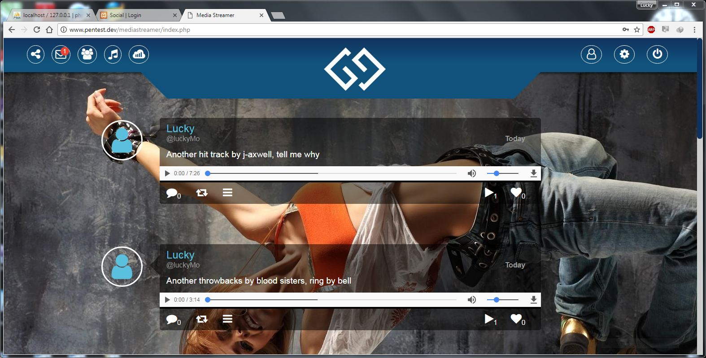

# MediaStreamer

# `MediaStreamer`

- __MediaStreamer is media streamingg application for sharing experience, music files and videos.__

## `Built With`

- PHP
- MYSQL
- HTML5
- CSS3
- JAVASCRIPT

## `Screenshot`

## `Getting Started`

You may use the following steps to get a local copy:

-Clone project to your local machine 

-cd to the project directory 

-Open project in IDE Open Live Preview through IDE or

-use localhost to view the project in your browser

**`Contributing`**

You are welcome to make contributions to the repository. Contributions may be made through issues comments and feature requests.

You may find the issues page [here](https://github.com/lubienga/PhotoBook/issues)
